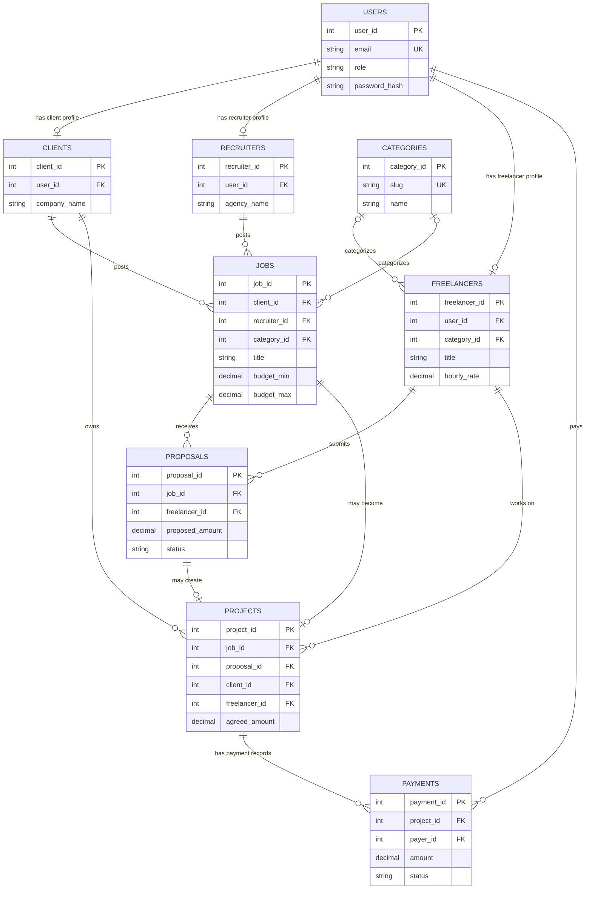
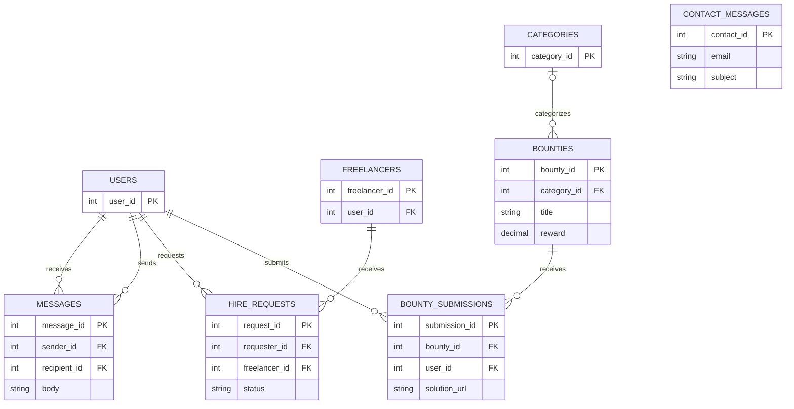

# Zonke Database ERD

This documentnation is for our databse [`zonke_database (1).sql`](zonke_database%20(1).sql). We shows the main relationships and how the API writes and reads data.

The schema we use utlises MySQL 8.0.16 . The initializer executes a schema file that drops and recreates its tables, so use it only when setting up or intentionally resetting a development database and erases existing records.

## Marketplace Data



A user has one account role and may have a matching client, recruiter, or freelancer profile. A client or recruiter posts a job; a freelancer can submit a proposal. A job and accepted proposal can be represented by a project. Payments refer to a project and the user who requested the payment.

## Other Activity



`CONTACT_MESSAGES` stores the user's name and email directly, so it does not require an account. Other supporting tables connect skills to freelancer profiles and jobs, record job attachments, recruiter shortlists, reviews, and blog posts.

## How Data Moves

1. The browser sends form data as JSON to the Express API.
2. Public reads, such as open jobs and freelancer profiles, use API `GET` routes. The API reads the database views `v_open_jobs` and `v_freelancer_profiles` to return display-ready data.
3. Write routes validate the request. Routes for private actions also check the JWT and the user's role.
4. The API runs parameterized SQL statements. MySQL keys and constraints keep related records connected and reject invalid relationships.
5. After a successful write, the API returns a success response and the page can reload the saved data from the API. The database, not browser `localStorage`, is the persistent source of truth.

## Connected API Actions

| User action | API route | Database records |
| --- | --- | --- |
| Register or log in | `POST /api/register`, `POST /api/login` | `users` plus the role profile; passwords are stored as salted `scrypt` hashes |
| Post a job | `POST /api/jobs` | `jobs` |
| Update freelancer profile | `PUT /api/freelancer/profile` | `freelancers`, `skills`, `freelancer_skills` |
| Apply to a job | `POST /api/proposals` | `proposals` |
| Request to hire | `POST /api/hire-requests` | `hire_requests` |
| Send a message | `POST /api/messages` | `messages` |
| Submit a bounty solution | `POST /api/bounty-submissions` | `bounty_submissions` |
| Request a payment | `POST /api/payments` | `payments` with `pending` status |
| Contact the team | `POST /api/contact` | `contact_messages` |


## Security in the API

- **Passwords:** registration stores salted `scrypt` hashes. Login verifies hashes with a timing-safe comparison; seed accounts with placeholder hashes cannot log in.
- **Authentication:** login and registration return a signed JWT that expires after 8 hours. Private write routes require a valid bearer token.
- **Role checks:** job posting is limited to clients and recruiters; proposals and bounty submissions to freelancers; profile updates to freelancers; payments to clients.
- **Request handling:** SQL values use placeholders, JSON request bodies are limited to 1 MB, and `/api` is rate-limited to 200 requests per 15 minutes.
- **Browser/API protections:** Helmet sets security headers, and CORS allows the local frontend origins used for development.
- **Database protections:** foreign keys, unique keys, and checks protect relationships and values such as payment amount and status.

For deployment, replace the development `JWT_SECRET` with a strong private value, serve the app over HTTPS, and set CORS to the real frontend domain. Payments are not processed by a provider yet; keep card numbers and CVVs out of the app and database.

## Components and Setup

| Component | Purpose | Locked version or requirement |
| --- | --- | --- |
| MySQL Server | Stores the Zonke schema and records | 8.0.16+ |
| Node.js and npm | Runs the API and installs its packages | Node.js 18+ |
| Express | HTTP API | 5.2.1 |
| `mysql2` | Promise-based MySQL connection pool | 3.24.4 |
| `dotenv` | Loads database and JWT settings from `.env` | 16.6.1 |
| `cors` | Allows the local frontend to call the API | 2.8.6 |
| `helmet` | Sets HTTP security headers | 8.3.0 |
| `express-rate-limit` | Limits API request frequency | 8.7.0 |
| `jsonwebtoken` | Creates and verifies login tokens | 9.0.3 |
| Node.js `crypto` | Generates salts and `scrypt` password hashes | Built into Node.js |

The SQL schema is the source of truth. `init-zonke-db.js` loads `.env` and executes that schema; `connection.js` creates the API's MySQL connection pool. The database initializer and connection check are project scripts.

For a local setup, from the `database` directory:

```sh
npm install
npm run db:init
npm run check:db
npm start
```

Serve the frontend over HTTP at `http://localhost:8080`; its API requests use `http://localhost:3001`. Run `npm run db:init` only to reset the database because it recreates the tables and seed data.
